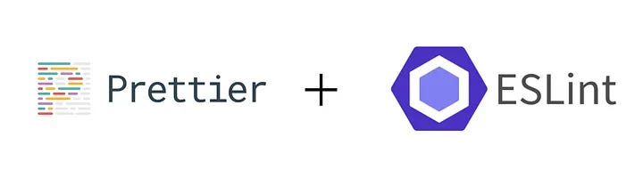

## Coding Standards Be Like

When people hear "coding standards," they usually think of nitpicky debates over tabs versus spaces or whether curly braces deserve their own line. But coding standards are much more than just style preferences, they can actually help you learn a programming language. And yes, that means even those annoying ESLint warnings are doing more than just making your editor light up like a Christmas tree.

## Actually Learning From ESLint?

I've been using ESLint with VSCode for the better half of a week, and honestly? It's not that bad. Some people act like getting rid of ESLint errors is the worst thing to happen since JavaScript's `==` operator, but I actually find it somewhat useful. Instead of blindly following rules, I'm learning best practices as I code. ESLint forces me to think about things like proper scoping, avoiding unnecessary variables, and writing cleaner functions. Things that actually matter when writing maintainable code.

## Painful, but Useful

That's not to say ESLint is always a walk in the park. Sometimes, it feels like it's nagging me over trivial things, like when it insists I use `===` even though I know for a fact my comparison is fine. But in the long run, these small annoyances push me toward better habits. It's like a strict but well-meaning driving instructor who won't let you merge without looking. Sure, it's annoying and you feel like you know better, but future you will be grateful. But don't ever merge without looking, seriously.

## Conclusion: Standards That Actually Make a Difference

So yeah, I'd say I'm on board with coding standards. They're not just about making your code look pretty, they actually shape the way you think about writing good code. ESLint isn't perfect, but it is a great tool for reinforcing best practices, especially when learning a new language. And hey, if following coding standards means fewer headaches when debugging, I'll take that trade any day.

* ChatGPT used for grammar.
