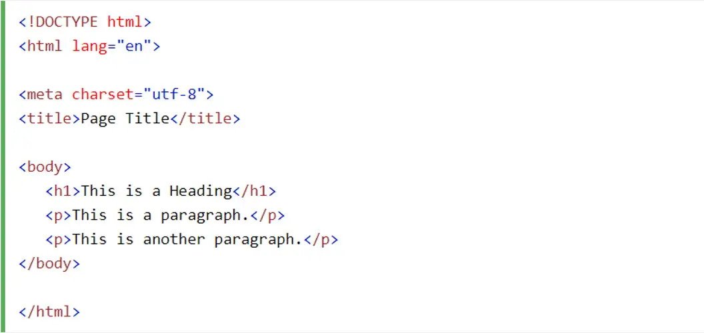

## UI Frameworks: A Curse, A Blessing, & Everything In Between

If you've ever tried to build a website from scratch, you know the feeling. You start with some innocent HTML, maybe sprinkle in a little CSS, and before you know it, you're knee-deep in a swamp of divs, floating elements, and the existential crisis of centering a `
`. Enter UI frameworks, the saviors of front-end development—or at least, that's what the documentation promises.

## The Gateway Drug: Plain Old HTML & CSS

Learning HTML and CSS was like learning to ride a bike: wobbly at first, but mostly painless. Unlike Java or JavaScript, where forgetting a semicolon could mean an entire program self-destructs, HTML and CSS are forgiving. You miss a closing tag? The browser shrugs. Your CSS looks ugly? That's a skill issue, not a compiler error.

Early on, I built a simple website detailing the history of Internet browsers. A timeline, some images, and a list of questionable design choices later, I had a functional webpage. It wasn't anything flashy or looked like it was made using SquareSpace, but it worked. And then came Bootstrap 5 which, depending on the day, feels like either a superpower or a cryptic puzzle.

## Bootstrap 5: A Cheat Code for Web Design

Bootstrap 5 is marketed as "responsive, mobile-first, and easy to use." And to be fair, it kind of is. Instead of manually writing CSS for every screen size, Bootstrap hands you a grid system on a silver platter. Instead of battling float: left;, you can just slap d-flex justify-content-center on an element and move on with your life.

Take this simple Bootstrap 5 button, for example:
`<button class="btn btn-primary">Click me</button>`
That's it. No border-radius, no box-shadow, no debating which shade of blue looks the least offensive. It just works.

Compare that to writing pure CSS:
`button {
    background-color: #007bff;
    color: white;
    padding: 10px 20px;
    border: none;
    border-radius: 5px;
    cursor: pointer;
}
button:hover {
    background-color: #0056b3;
}`
Who has time for that? Not me.

## The Bootstrapification of Everything

Things started ramping up when I implemented Bootstrap 5 for an IslandSnow website, and later, the Beabadoobee webpage remake. It became clear that Bootstrap is both a blessing and a crutch.

For the Beabadoobee site, I quickly got the layout working with Bootstrap's grid system. But then, small inconsistencies started creeping in. The footer was too low, the image wouldn’t align perfectly, and the spacing was just... off. It turns out Bootstrap gives you a solid foundation, but it doesn't mean you can skip the fine-tuning.

And then came the great war of vertical alignment. I tried `vh-100`, `d-flex align-items-center`, `mt-auto`, and every combination in between. At some point, I realized I had spent more time aligning the footer than actually building the website.

## UI Frameworks: Training Wheels or Necessary Evil?

Bootstrap, like all UI frameworks, is both a shortcut and a limitation. On one hand, it lets you spin up a somewhat professional-looking website in record time. On the other, it can make you lazy. Instead of understanding how CSS flexbox works, you just Google "Bootstrap center div" and copy-paste the first Stack Overflow answer.

Of course, there's also the danger of every Bootstrap site looking the same. You can always tell when a website is just default Bootstrap components with zero customization buttons with the default blue color, cards with the default shadow, and a navbar that looks suspiciously like every other Bootstrap navbar in existence.

## Is It Worth It?

Absolutely. Bootstrap 5 (and UI frameworks in general) are exceptional game-changers, especially for rapid development. But they shouldn't replace learning the fundamentals. If Bootstrap is a crutch, HTML & CSS are the legs. Use the framework, but understand what's happening under the hood.

Also, if you ever find yourself spending 30 minutes trying to vertically center text, just remember: somewhere out there, another developer is fighting the same battle. Stay strong!

* ChatGPT used for grammar.
